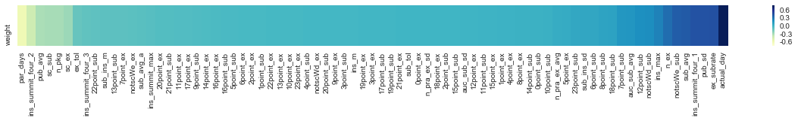

# FA

#### 1.KMO test

KMO = 0.218（当KMO小于0.5时候都不适合做因子分析），说明 **各变量间的相关性较小** 。


#### 2.FA result

尽管如此还是基于PCA的结果（以75%的标准得到17个主成分），选择了17个component，采用了varimax和promax两种旋转方式来看（两种旋转方式的相差结果不大）


* 依据构造的指标来看，这堆数据的主要信息量体现在学生在几个时刻上的做题数和提交数量，其次是两次提交的时间间隔，每次提交得到的分数，做作业的间隔天数


# LR

#### 1.cross validation：

```
CV f1: 0.926 +/- 0.019
```

#### 2.confusion matrix：

```
array([[  2545,  12753],
       [  1659, 112211]])
```

#### 3.weight



* 做作业时间更久(actual_day)、每次提交中做题数(ex_subrate)更多的学生更容易续费——**投入时间：投入时间越多的越容易续费**
* 自老师布置作业后隔多久去做题的方差(pub_sd)，方差越大（波动越大）的学生更容易续费——**做题习惯（出乎意料的）：做题不规律的越容易续费**
* 两次提交时间间隔的中位数，越小越容易续费(ins_summit_four_2)；两次提交时间间隔的下四分位数(ins_summit_four_1)，越大越容易续费——**做题的频繁程度：做题越频繁越容易续费**
* 购买套餐后实际经过了多久开始做题(par_days)——**唤醒时间：唤醒时间越短的越容易续费**

#### 4.probabilty


数量：

```
no renewal: 198
renewal: 103064
potential: 327296
```

占比：

```
no renewal: 0.0039
renewal: 0.2714
potential: 0.7247
```

#### 5.difference

* 时间段（一天）

  

  续费的学生做作业量大，提交数量也比较大（上下图形态基本一致）；
  不续费的学生做作业量大，但是提交数量却相对较少（下图的做题数相对上图的提交数要多）

* 时间段（全年）

| submission                      | exercise                      |
| ------------------------------- | ----------------------------- |
|  |  |

​	续费的学生，在假期的提交/做作业量大，明显多于周末和工作日的量；
​	不续费的学生，在周末、工作日、假期的提交/做作业量差别没有那么大，周末的提交/做作业量相对多一些

* 方差齐次性检验—独立样本T检验：
  * 投入时间、做题习惯、做题的频繁程度、唤醒时间上均有显著差异
  * 练习的分数有显著差异，但是在LR中没有较大weight，说明做题的分数不是影响是否续费的原因

