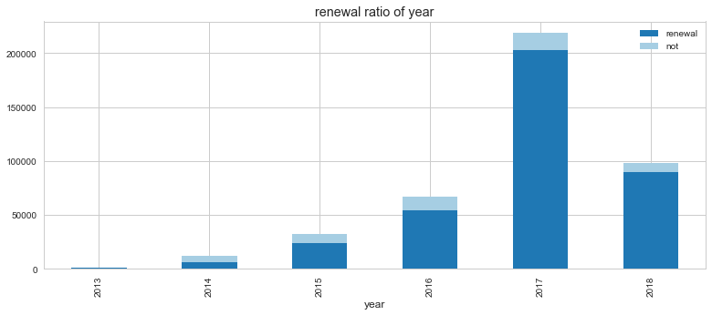
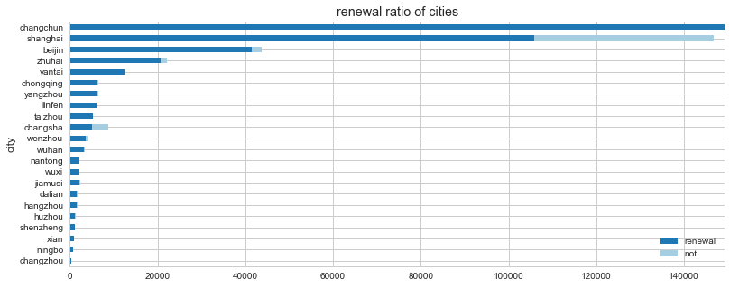
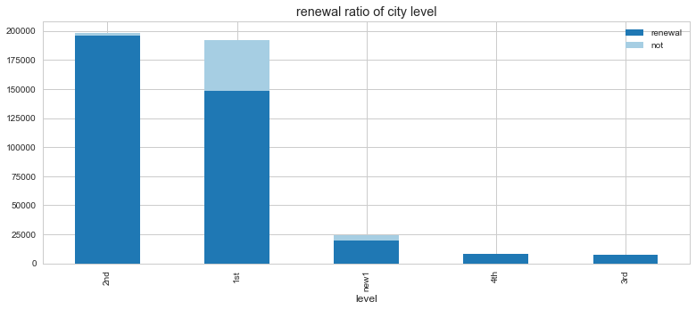
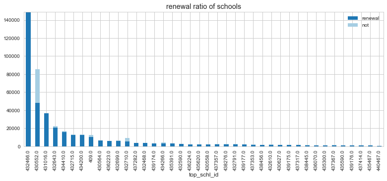
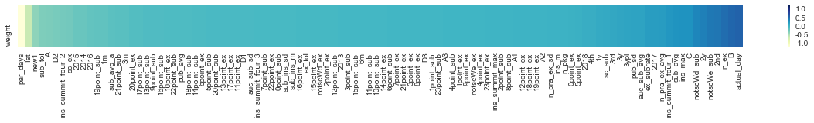
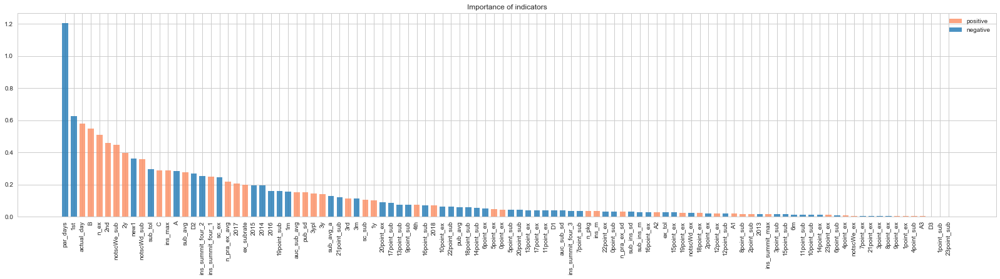
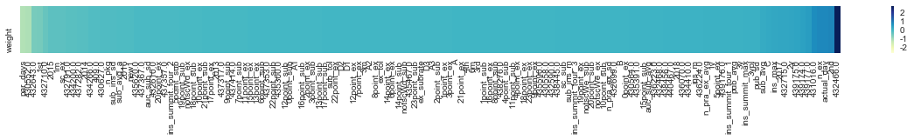
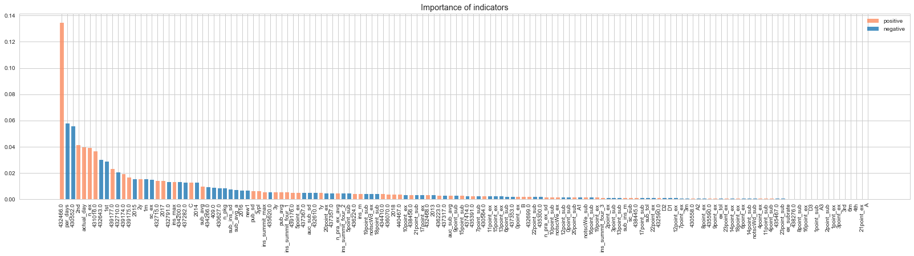

# 续费率与作业因素分析

### 1.数据基本情况

​	数据包含429971条学生记录， 涉及40个机构。包含的时间跨度为2013.06.13（套餐最早的开始时间）—2018.05.09（套餐最晚结束时间）。以套餐的开始的年份为记录，每年的套餐续费情况如下图示，

​	其中，涉及到的城市包括【长春市，上海市， 北京市，珠海市，烟台市，长沙市，重庆市，扬州市，临汾市，台州市，温州市，武汉市，佳木斯市，南通市，无锡市，杭州市，大连市，湖州市，深圳市，西安市，宁波市，常州市】（图中用拼音简称）。

​	对city的标注，通过网上搜索机构总部所在城市标注，对城市级别的划分基于[2017年中国城市新分级名单](https://baike.baidu.com/item/%E4%B8%AD%E5%9B%BD%E5%9F%8E%E5%B8%82%E6%96%B0%E5%88%86%E7%BA%A7%E5%90%8D%E5%8D%95/12702007)划分。本数据中包括了【一线城市，新一线城市，二线城市，三线城市，四线城市】。

​	下表为该40所机构续费信息及标准信息（按续费率由高到低排列）。

| Index | top_schl_id | top_schl_nm | 续费率      | city | city_level |
| ----- | ----------- | ----------- | -------- | ---- | ---------- |
| 0     | 439175      | XXXX        | 0.875562 | 北京市  | 1st        |
| 1     | 437282      | XXXX        | 0.863689 | 台州市  | 2nd        |
| 2     | 430627      | XXXX        | 0.860037 | 台州市  | 2nd        |
| 3     | 432715      | XXXX        | 0.853444 | 北京市  | 1st        |
| 4     | 435467      | XXXX        | 0.841530 | 宁波市  | new1       |
| 5     | 437353      | XXXX        | 0.838024 | 大连市  | new1       |
| 6     | 440467      | XXXX        | 0.830601 | 常州市  | 2nd        |
| 7     | 435590      | XXXX        | 0.812030 | 西安市  | new1       |
| 8     | 432466      | XXXX        | 0.808722 | 长春市  | 2nd        |
| 9     | 437367      | XXXX        | 0.804795 | 武汉市  | new1       |
| 10    | 430558      | XXXX        | 0.792985 | 无锡市  | 2nd        |
| 11    | 439176      | XXXX        | 0.792880 | 北京市  | 1st        |
| 12    | 439177      | XXXX        | 0.784658 | 北京市  | 1st        |
| 13    | 437414      | XXXX        | 0.783459 | 上海市  | 1st        |
| 14    | 439174      | XXXX        | 0.780660 | 北京市  | 1st        |
| 15    | 437357      | XXXX        | 0.778698 | 佳木斯市 | 4th        |
| 16    | 438445      | XXXX        | 0.772472 | 上海市  | 1st        |
| 17    | 434266      | XXXX        | 0.762042 | 北京市  | 1st        |
| 18    | 432610      | XXXX        | 0.756579 | 杭州市  | new1       |
| 19    | 432643      | XXXX        | 0.747295 | 珠海市  | 2nd        |
| 20    | 430564      | XXXX        | 0.744577 | 扬州市  | 3rd        |
| 21    | 431016      | XXXX        | 0.740994 | 上海市  | 1st        |
| 22    | 430552      | XXXX        | 0.725296 | 上海市  | 1st        |
| 23    | 438456      | XXXX        | 0.717172 | 温州市  | 2nd        |
| 24    | 409         | XXXX        | 0.712044 | 上海市  | 1st        |
| 25    | 435620      | XXXX        | 0.711844 | 南通市  | 2nd        |
| 26    | 435391      | XXXX        | 0.696065 | 重庆市  | new1       |
| 27    | 434200      | XXXX        | 0.680562 | 烟台市  | 2nd        |
| 28    | 432791      | XXXX        | 0.678915 | 温州市  | 2nd        |
| 29    | 432468      | XXXX        | 0.665628 | 重庆市  | new1       |
| 30    | 438276      | XXXX        | 0.661081 | 上海市  | 1st        |
| 31    | 436070      | XXXX        | 0.589641 | 深圳市  | 1st        |
| 32    | 437317      | XXXX        | 0.577928 | 湖州市  | 3rd        |
| 33    | 432590      | XXXX        | 0.567696 | 北京市  | 1st        |
| 34    | 432699      | XXXX        | 0.521689 | 上海市  | 1st        |
| 35    | 435300      | XXXX        | 0.473684 | 上海市  | 1st        |
| 36    | 434410      | XXXX        | 0.438286 | 北京市  | 1st        |
| 37    | 432710      | XXXX        | 0.303844 | 长沙市  | new1       |
| 38    | 436223      | XXXX        | 0.213555 | 临汾市  | 4th        |
| 39    | 436224      | XXXX        | 0.139404 | 武汉市  | new1       |
| 40    | 440129      | XXXX        | 0.000000 | 鸡西市  | 5th        |

​	机构的续费情况，如下图所示，

### 2.指标

在分析中用到的指标主要包括：

| Indicators        | Description                              |
| ----------------- | ---------------------------------------- |
| visa_typ_cd       | 套餐类型（9种） [A, A1, A2, A3, B, C, D1, D2, D3] |
| usr_visa_strt_tm  | 套餐的开始时间 最早:2013-06-13      最晚:2018-04-21 |
| usr_visa_end_tm   | 套餐结束时间 最早:2013-06-14      最晚:2018-05-09 |
| par_days          | 最后一次做作业和第一次做作业间的时间间隔                     |
| actual_day        | 套餐时间内实际的做作业天数(与套餐的时间长短相关)                |
| sub_tol           | 套餐时间内总的提交次数                              |
| sub_avg           | 套餐时间内每天的平均提交次数（sub_tol / par_days）       |
| sub_avg_a         | 套餐时间内实际做作业天数的平均提交次数（sub_tol /actual_day） |
| ex_tol            | 套餐时间内总的做题数量                              |
| ex_subrate        | 每个package的提交比例                           |
| sub_ins_sd        | 两次提交的时间间隔的方差(单位s)。超过12H(43200s)就不认为该间隔有意义，归0 |
| sub_ins_m         | 两次提交的时间间隔的均值(单位s)                        |
| ins_m             | 做作业间隔天数的均值                               |
| auc_sub_avg       | 每次提交的平均分数                                |
| auc_sub_sd        | 每次提交的分数的方差                               |
| ins_max           | 最大的做作业间隔天数                               |
| ins_summit_four_1 | 两次提交的时间间隔的下四分位数（单位S）                     |
| ins_summit_four_2 | 两次提交的时间间隔的中位数（单位S）                       |
| ins_summit_four_3 | 两次提交的时间间隔的上四分位数（单位S）                     |
| ins_summit_max    | 两次提交的最大时间间隔（单位S）                         |
| 0point_sub        | 0点—1点之间的提交次数                             |
| …...              | (24h各小时内的提交数量)                           |
| 23point_sub       | 23点—0点之间的提交次数                            |
| 0point_ex         | 0点—1点之间的做题数量                             |
| …...              | (24h各小时内的提交数量)                           |
| 23point_ex        | 23点—0点之间的做题数量                            |
| notscWe_sub       | 周末的提交次数（不包含寒暑假）                          |
| notscWe_ex        | 周末的做题数量（不包含寒暑假）                          |
| notscWd_sub       | 工作日的提交数量（不包含寒暑假）                         |
| notscWd_ex        | 工作日的做题数量（不包含寒暑假）                         |
| sc_sub            | 寒暑假的提交数量                                 |
| sc_ex             | 寒暑假的做题数量                                 |
| pub_avg           | 老师布置作业后学生平均隔几天去做题                        |
| pub_sd            | 老师布置作业后学生隔几天去做题的方差                       |
| n_ex              | 总的做题数量                                   |
| n_pkg             | 总的package数量                              |
| n_pra_ex_avg      | 每一道题的练习次数的均值                             |
| n_pra_ex_sd       | 每一道题的练习次数的方差                             |
| top_schl_id       | 机构ID(40所)                                |
| delta_days        | 套餐的持续时间                                  |
| delta_lable       | 套餐的持续时间分桶 [1周，1个月，3个月，半年，1年，2年，3年]    |
| year              | 套餐开始的年份 [2013, 2014, 2015, 2016, 2017, 2018] |
| Level             | 机构所在城市的级别 [一线城市，新一线城市，二线城市，三线城市，四线城市] |

### 3.Part Features

**使用的指标：**爱莎抽取的指标 +【 套餐的持续时间、套餐的起始年份、机构所在的城市级别】

**方法：**类别变量做one-hot处理，使用Logistic Regression计算每个特征对续费的影响程度

（**注意**：两边的因素为非续费率影响比较大的因素，左边为负向影响，右边为正向影响）

计算各指标在所选指标中的权重，可得到各指标的影响权重（累加和为1）：

**主要影响因素：**

| 负向影响（指标及权重）                              | 正向影响（指标及权重）                              |
| ---------------------------------------- | ---------------------------------------- |
| par_days(- 0.0947): 最后一次做作业和第一次做作业间的时间间隔 1st(- 0.04926): 一级城市 new1(-0.0283):新一线城市 sub_tol( -0.02332): 总的提交次数 A(- 0.02234): A套餐 | actual_day( 0.04552): 实际做作业天数 B( 0.04297):B套餐 n_ex( 0.03997): 总的做题数 2nd( 0.03609): 二线城市 notscWe_sub(0.45):工作日的提交数 |

### 4.All Features

**使用的指标：**sara抽取的指标 +【 套餐的持续时间、套餐的起始年份、机构所在的城市级别】+ **机构ID**

**方法：**类别变量做one-hot处理，使用Logistic Regression计算每个特征对续费的影响程度

（注意：两边的因素为非续费率影响比较大的因素，左边为负向影响，右边为正向影响）

计算各指标在所选指标中的权重，可得到各指标的影响权重（累加和为1）：

**主要的影响因素：**

| 负向影响（指标及权重）                              | 正向影响（指标及权重）                              |
| ---------------------------------------- | ---------------------------------------- |
| par_days(-0.0576):最后一次做作业和第一次做作业间的时间间隔 430552(-0.0554):XXXX学校 432643(-0.0230):XXXX学校 1st(-0.0288):机构所在城市为1线城市  432710(- 0.0203):XXXX学校 | 432466( 0.1347):XXXX学校 2nd( 0.0415):机构所在城市为2线城市 actual_day( 0.0396):实际做作业的天数 n_ex( 0.0392):学生实际的做题数量 431016(0.0363):XXXX学校 439177(0.0230):XXXX学校 |

​	加入机构特征以后，很明显的是，大多数特征权重下降，部分机构的影响比重占比较大，仅保留部分仍然对续费具有影响力的因素。

### 总结

​	因此，影响续费与否的主要因素表现为，

1. 机构：
   * 机构是影响续费与否的主要因素，其中XXXX学校(432466, 共有149172条记录)、XXXX学校(431016, 共有36703条记录)、XXXX学校(439177, 共1758条记录)对续费有正向的影响，XXXX学校(430552, 共85648条记录)、XXXX学校(432643, 共22153条记录)有负向影响（续费率不高）
   * 机构所在的城市级别，二线城市(2nd, 19814条记录)的续费率较高，一线城市(1st, 191605条记录)对续费有负向的影响
2. 用户行为方面：
   * 最后一次做作业和第一次做作业间的时间间隔（par_days），越久越不容易续费
   * 做题数量越多的越容易续费（n_ex），提交数量越多的越不容易续费

